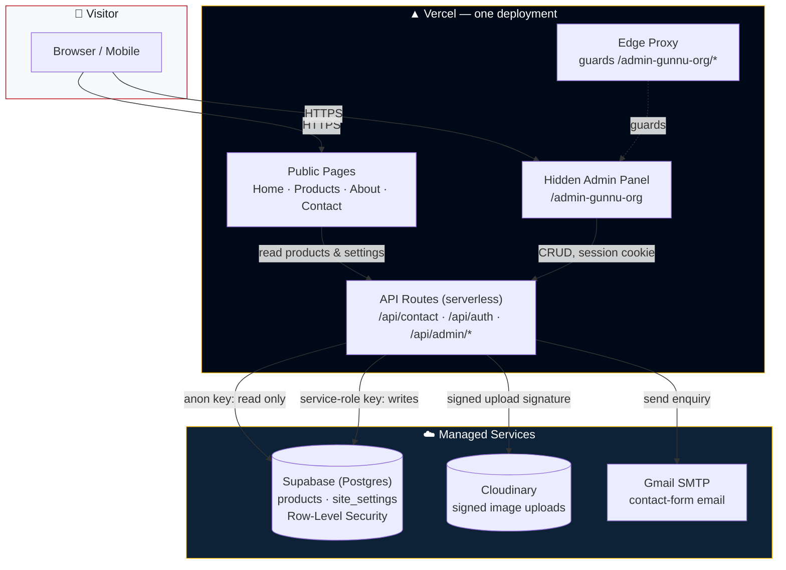
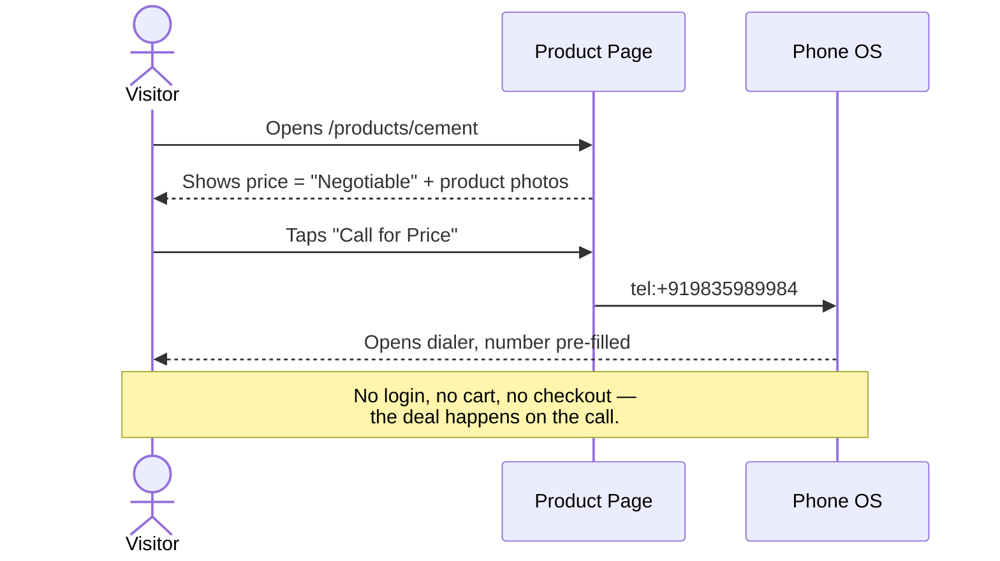
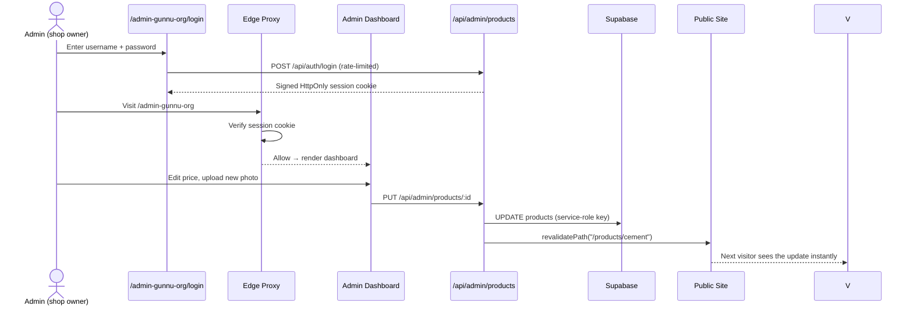
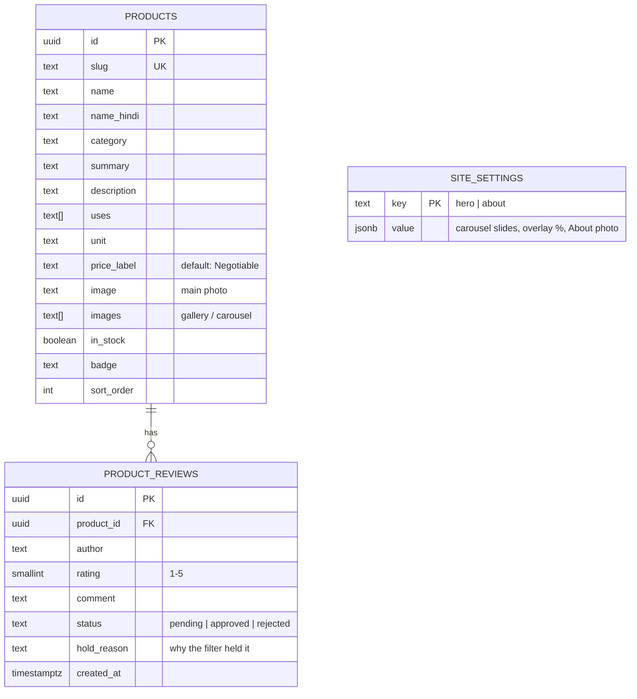

<div align="center">

# 🏗️ Kamakhya Traders

**Building Materials, Delivered with Trust.**

A production-grade storefront + hidden admin panel for a building-materials
supplier in **Neora, near Railway Gumti, Patna (Bihar)** — cement, iron rods,
stone chips, sand, bricks, bamboo and plywood, sold the local way: browse
online, **call for price**, no cart, no login.

[](https://nextjs.org/)
[](https://www.typescriptlang.org/)
[](https://tailwindcss.com/)
[](https://supabase.com/)
[](https://cloudinary.com/)
[](https://vercel.com/)
[]()

</div>

---

## ✨ What this is

A **Turborepo monorepo** containing one Next.js 16 App Router application that
is *both* the public storefront and its own serverless backend — one `next
build`, one Vercel deploy, no separate API service to manage.

| | |
|---|---|
| 🛍️ **Storefront** | Home, Products (with image carousels), About, Contact — fully responsive, animated, SEO-tuned for local search |
| 🔒 **Hidden admin** | `/admin-gunnu-org` — not linked anywhere public, blocked from search engines, session-cookie protected |
| 📞 **"Call for Price" model** | No cart, no checkout — every product CTA opens the dialer or WhatsApp, matching how the business actually sells |
| 🗄️ **Editable content** | Products, hero banner carousel, and About photo are all editable from the admin — no code changes needed to update the site |
| 🛡️ **Security-first** | CSP, rate limiting, RLS, signed uploads, constant-time auth — see [Security](#-security) |

---

## 🗺️ Architecture



### Why this shape?

- **One Next.js app, not two.** The "backend" is Next.js **Route Handlers**
  running as Vercel serverless functions — same deploy as the frontend, same
  domain, zero CORS, zero extra hosting bill.
- **Supabase is the only stateful piece**, and it's accessed two ways: the
  public site reads with the **anon key** (Row-Level Security allows reads
  only), while every write goes through a `/api/admin/*` route using the
  **service-role key**, which never reaches the browser.
- **A hidden URL is not real security** — so `/admin-gunnu-org` is *also*
  guarded by an edge **Proxy** (`src/proxy.ts`) that checks a signed session
  cookie before any admin page renders.

---

## 🔄 Request flow — "Call for Price"

The core interaction on the site: a visitor never adds anything to a cart —
they tap one button and the phone opens.



---

## 🛠️ Admin: editing a product, end to end



---

## 🗂️ Data model



Every table has **Row-Level Security** enabled. Anyone may `SELECT` products
and site settings; for `product_reviews` the public policy exposes only rows
with `status = 'approved'`, so a held review cannot leak to a visitor even if
the storefront code had a bug. Nothing is writable except through the server
(service-role key). See [`supabase/schema.sql`](supabase/schema.sql).

---

## 📁 Project structure

```
kamakhya-traders/
├── apps/
│   └── web/                          # Next.js app — frontend AND backend
│       ├── src/
│       │   ├── app/
│       │   │   ├── (site pages)      # /, /products, /products/[slug], /about, /contact
│       │   │   ├── admin-gunnu-org/  # 🔒 Hidden admin panel + /hero settings
│       │   │   ├── api/
│       │   │   │   ├── contact/      # Gmail SMTP, rate-limited, honeypot
│       │   │   │   ├── auth/         # login / logout (signed cookie)
│       │   │   │   └── admin/        # products CRUD, hero/about settings, uploads
│       │   │   ├── sitemap.ts · robots.ts · opengraph-image.tsx
│       │   ├── components/           # Header, Footer, Hero, ProductCard, admin UI…
│       │   ├── data/                 # Built-in product catalogue (fallback + seed source)
│       │   ├── lib/                  # site config, supabase, cloudinary, mailer, auth, seo…
│       │   └── proxy.ts              # Edge guard for /admin-gunnu-org/*
│       └── public/images/products/   # Placeholder SVG art (used until real photos are added)
├── supabase/
│   ├── schema.sql                    # Tables + Row-Level Security — run once
│   ├── seed.sql                      # Loads the 7 default products
│   ├── hero-settings.sql             # Hero carousel + About-photo settings table
│   ├── product-images.sql            # Adds the product photo gallery column
│   └── product-reviews-table.sql     # Customer reviews table + RLS + migration
├── .github/workflows/
│   └── supabase-keepalive.yml        # Pings Supabase every 2 days so the free tier never pauses
├── .env.example                      # Every environment variable, documented
└── turbo.json / package.json         # Monorepo config
```

---

## 🚀 Getting started

```bash
npm install
npm run dev
```

Open **http://localhost:3000**. Admin panel: **http://localhost:3000/admin-gunnu-org**
(credentials come from `apps/web/.env.local`).

The site works **out of the box with zero configuration** — a built-in
product catalogue and illustrated placeholders render immediately. Supabase,
Cloudinary and Gmail SMTP are opt-in upgrades, switched on by adding
environment variables.

### 1 · Supabase (product database)

1. Create a project at [supabase.com](https://supabase.com).
2. **Project Settings → API** → copy into `apps/web/.env.local`:
   `NEXT_PUBLIC_SUPABASE_URL`, `NEXT_PUBLIC_SUPABASE_ANON_KEY` (publishable),
   `SUPABASE_SERVICE_ROLE_KEY` (secret — server only).
3. **SQL Editor** → run in order: `schema.sql` → `seed.sql` →
   `hero-settings.sql` → `product-images.sql` → `product-reviews-table.sql`.

   > `product-reviews-table.sql` is required for customer reviews. Until it is
   > run, product pages simply show no reviews and the review form returns a
   > "not available right now" message — nothing else breaks. Running it also
   > copies any reviews previously stored on `products.reviews` into the new
   > table. It is safe to re-run.

### 2 · Cloudinary (product images)

Create an account, copy `NEXT_PUBLIC_CLOUDINARY_CLOUD_NAME`,
`CLOUDINARY_API_KEY`, `CLOUDINARY_API_SECRET` into `.env.local`. Uploads are
**signed** server-side — the API secret never reaches the browser.

### 3 · Gmail SMTP (contact form)

Enable 2-Step Verification on the Gmail account, create an
[App Password](https://myaccount.google.com/apppasswords), put it in
`SMTP_PASS`.

### 4 · Deploy to Vercel

1. Push to GitHub → **Import** in Vercel → **Root Directory: `apps/web`**.
2. Add every variable from `.env.example` under
   **Settings → Environment Variables**.
3. Deploy. Frontend + all API routes ship together, one project.

Full step-by-step for each service lives inline in
[`.env.example`](.env.example).

---

## 🛡️ Security

| Layer | What's in place |
|---|---|
| **Headers** | CSP, `X-Frame-Options: DENY`, `X-Content-Type-Options: nosniff`, HSTS, Referrer-Policy, Permissions-Policy |
| **Admin auth** | Rate-limited login (5 / 15 min), constant-time credential check, signed **HttpOnly + SameSite=Strict** session cookie, edge-level route guard, open-redirect–safe post-login navigation |
| **Database** | Supabase **Row-Level Security** — public reads only; every write goes through a server route using the service-role key, which is `server-only`-guarded and never bundled to the client |
| **Contact form** | Zod validation, rate limiting (5 / 10 min per IP), honeypot field, HTML-escaped email body |
| **Uploads** | Cloudinary **signed** uploads — secret never touches the browser |
| **Secrets** | Nothing hardcoded — domain, phone numbers, and every key live in environment variables; `.env.local` is gitignored |
| **Dependencies** | `npm audit` — **0 vulnerabilities** |

---

## ⭐ Customer reviews

Visitors write reviews on each product page; the owner moderates them from
**`/admin-gunnu-org/reviews`**.

```
visitor submits  →  POST /api/reviews  →  rate limit + honeypot + abuse filter
                                                  │
                        clean ──────────────────► status: approved  (live at once)
                        suspicious ─────────────► status: pending   (hidden, owner decides)
```

- **The filter** ([`src/lib/review-filter.ts`](apps/web/src/lib/review-filter.ts))
  holds anything containing abuse (English, romanised Hindi and Devanagari),
  links, email addresses, phone numbers, repeated-character spam or ALL CAPS.
  It checks the reviewer's name as well as the text. It is deliberately biased
  towards holding: a wrong hold costs one click, a wrong pass puts abuse on a
  customer-facing page.
- **The owner** can approve, edit the wording, hide, or permanently delete any
  review — held or already live. Anything waiting shows as a red badge on the
  dashboard.
- **Writes never come from the browser.** There is no public `INSERT` policy;
  reviews are inserted server-side with the service-role key, so the rate
  limit, honeypot and filter cannot be bypassed by posting straight to
  Supabase.
- Product **structured data** is emitted only once a product has approved
  reviews, and its `aggregateRating` is computed from exactly the reviews
  rendered on the page — never invented numbers.

---

## 🔍 SEO

- Unique `<title>` + description per page, led by **Danapur, Patna** (the way
  customers actually search) with Neora, Khagaul, Bihta and Phulwari Sharif
  alongside, in English and Hindi.
- **LocalBusiness/HardwareStore** JSON-LD with exact geo-coordinates, map
  link, hours, and service area — the strongest signal for "near me" search
  and the Google Maps 3-pack.
- Auto-generated `sitemap.xml` and `robots.txt` (admin + API routes excluded).
  `lastmod` reports each product's real `updated_at` rather than the build
  time — a sitemap whose dates are always "now" teaches Google to ignore them.
- **Internal linking:** the footer links every product from every page, and
  each product page links its siblings. Pages reachable from only one place
  are the ones Google leaves in "Discovered – currently not indexed".
- Per-product **Product** structured data (only with real reviews — see above);
  **ItemList** on the catalogue page; branded Open Graph image for
  WhatsApp/social link previews.
- Real favicon set (`.ico` + SVG + Apple touch icon) generated from the brand
  mark — no default framework logo in the browser tab.

> **Biggest lever beyond the code:** a free **Google Business Profile** with
> the same name/address/phone as the site, plus a handful of customer
> reviews. That — not the website alone — is what wins local search.

---

## 🎨 Brand

| Navy | Red | Gold |
|---|---|---|
| `#000917` | `#bb0114` | `#fdbc0a` |

*Behtareen Quality · Uchit Mulya · Aapki Santushti Hamari Pehchan*
— Best Quality · Fair Price · Your Satisfaction is Our Identity.

---

## 📜 Useful commands

```bash
npm run dev      # start dev server
npm run build    # production build
npm run start    # run the production build
npm run lint     # lint
```

---

<div align="center">

**Kamakhya Traders** · Neora, Near Railway Gumti, Patna, Bihar – 801113

</div>
